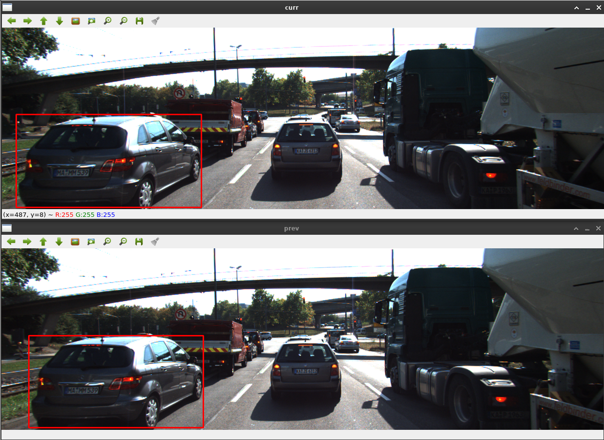
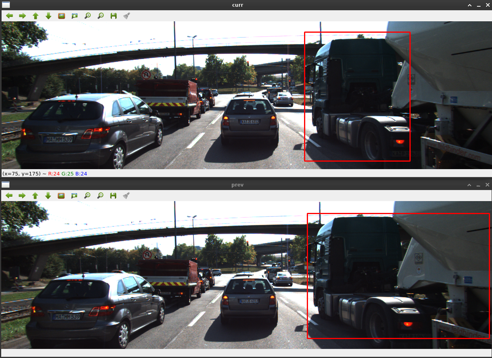
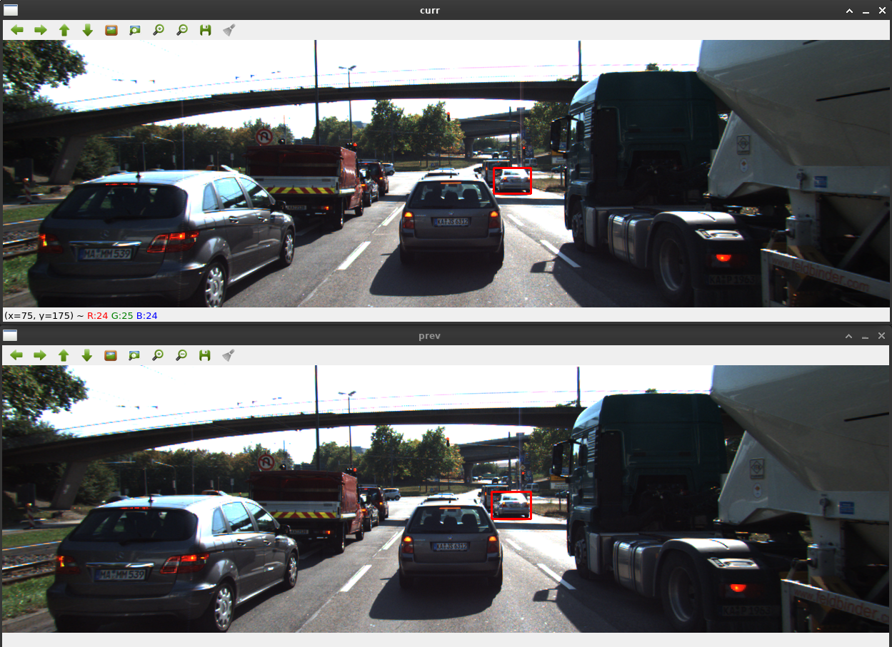
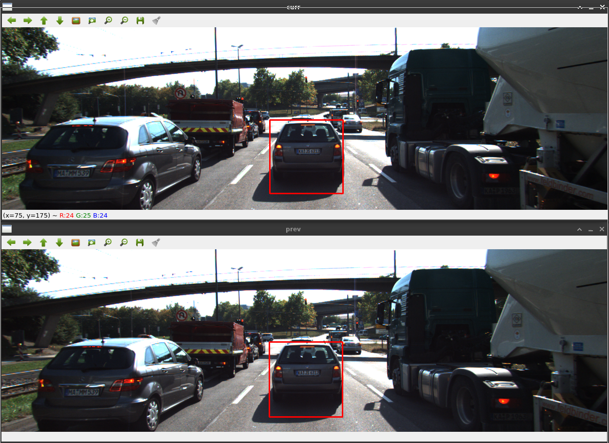

# SFND 3D Object Tracking

Welcome to the final project of the camera course. By completing all the lessons, you now have a solid understanding of keypoint detectors, descriptors, and methods to match them between successive images. Also, you know how to detect objects in an image using the YOLO deep-learning framework. And finally, you know how to associate regions in a camera image with Lidar points in 3D space. Let's take a look at our program schematic to see what we already have accomplished and what's still missing.


In this final project, you will implement the missing parts in the schematic. To do this, you will complete four major tasks:
1. First, you will develop a way to match 3D objects over time by using keypoint correspondences.
2. Second, you will compute the TTC based on Lidar measurements.
3. You will then proceed to do the same using the camera, which requires to first associate keypoint matches to regions of interest and then to compute the TTC based on those matches.
4. And lastly, you will conduct various tests with the framework. Your goal is to identify the most suitable detector/descriptor combination for TTC estimation and also to search for problems that can lead to faulty measurements by the camera or Lidar sensor. In the last course of this Nanodegree, you will learn about the Kalman filter, which is a great way to combine the two independent TTC measurements into an improved version which is much more reliable than a single sensor alone can be. But before we think about such things, let us focus on your final project in the camera course.

## Dependencies for Running Locally
* cmake >= 2.8
  * All OSes: [click here for installation instructions](https://cmake.org/install/)
* make >= 4.1 (Linux, Mac), 3.81 (Windows)
  * Linux: make is installed by default on most Linux distros
  * Mac: [install Xcode command line tools to get make](https://developer.apple.com/xcode/features/)
  * Windows: [Click here for installation instructions](http://gnuwin32.sourceforge.net/packages/make.htm)
* Git LFS
  * Weight files are handled using [LFS](https://git-lfs.github.com/)
* OpenCV >= 4.1
  * This must be compiled from source using the `-D OPENCV_ENABLE_NONFREE=ON` cmake flag for testing the SIFT and SURF detectors.
  * The OpenCV 4.1.0 source code can be found [here](https://github.com/opencv/opencv/tree/4.1.0)
* gcc/g++ >= 5.4
  * Linux: gcc / g++ is installed by default on most Linux distros
  * Mac: same deal as make - [install Xcode command line tools](https://developer.apple.com/xcode/features/)
  * Windows: recommend using [MinGW](http://www.mingw.org/)

## Basic Build Instructions

1. Clone this repo.
2. Make a build directory in the top level project directory: `mkdir build && cd build`
3. Compile: `cmake .. && make`
4. Run it: `./3D_object_tracking`.

-----

## Project Writeup

The following writeup describes how all [Rubric](https://review.udacity.com/#!/rubrics/2550/view) points for the project have been adressed.

### FP.0 - Provide a Writeup for the Project
You're reading it ;-)

### FP.1 - Match 3D Objects
The bounding box matching between the current frame and the previous one, based on a keypoint matching, is done in `camFusion_Student.cpp` in the function `matchBoundingBoxes` starting at line 247:

```c++
// Each DMatch contains two keypoint indices, queryIdx and trainIdx, based on the order of image arguments to match.
// https://docs.opencv.org/4.1.0/db/d39/classcv_1_1DescriptorMatcher.html#a0f046f47b68ec7074391e1e85c750cba
// prevFrame.keypoints --> queryIdx
// currFrame.keypoints --> trainIdx
multimap<int, int> multiMap {};

// loop over all matches
for(auto match : matches) {

    // get keypoints of matched pair
    cv::KeyPoint prevKeypoint = prevFrame.keypoints[match.queryIdx];
    cv::KeyPoint currKeypoint = currFrame.keypoints[match.trainIdx];

    // loop over all current bounding boxes
    for(auto currBoundingBox : currFrame.boundingBoxes)

        // check if the current keypoint lies in the current bounding bxo
        if(currBoundingBox.roi.contains(currKeypoint.pt))

            // if yes, loop over all previous bounding boxes
            for(auto prevBoundingBox : prevFrame.boundingBoxes)

                // check if the previous keypoint lies in the previous bounding box
                if(prevBoundingBox.roi.contains(prevKeypoint.pt))

                    // if all conditions met, add the matching candidate to the multimap
                    multiMap.insert({currBoundingBox.boxID, prevBoundingBox.boxID});
}

// check for each current bounding box if there are candidates
for(auto currBoundingBox : currFrame.boundingBoxes) {

    // get iterators to all matches of the current bounding box with previous boxes
    auto range = multiMap.equal_range(currBoundingBox.boxID);

    // build a vector to count the box matches per candidate
    vector<int> matchVector(prevFrame.boundingBoxes.size(), 0);

    // increment the matches to effectively count the box matches
    for(auto it = range.first; it != range.second; ++it)
        matchVector.at(it->second)++;

    // get best match as element with the maximum match count
    auto maxIt = max_element(matchVector.begin(), matchVector.end());

    // take care for empty sets (should never happen) and if there are matches by
    // checking occurences > 0
    if((maxIt != matchVector.end()) && (*maxIt > 0))

        // insert the match into the resulting maü
        bbBestMatches.insert({distance(matchVector.begin(), maxIt), currBoundingBox.boxID});
}
```

The code should be quite self explanatory with it's comments, but in general the following steps are done:

* loop over each match of keypoints and extract the keypoint pair
* check in which bounding boxes of the current frame the keypoint for the current image is contained
* if a bounding box is found, loop over all bounding boxes in the previous frame and check if the matched keypoint for the previous frame is contained
* if there are bounding boxes found for the keypoint pair, store it in a multimap in the form {current bounding box id, previous bounding box id}
* after all matches have been covered, extract all matches for each bounding box in the current frame
* if there are matches present, check the according previous bounding box with the biggest match count
* add the best previous and the current box id to the return map

The matching works quite well most of the time, here are some examples:

Example 1:


Example 2:


Example 3:


Example 4:


### FP.2 - Compute Lidar-based TTC
The lidar TTC calculation is implemented in `camFusion_Student.cpp` function `computeTTCLidar`, starting at line 212:

```c++
// calculate time between two frames
double dT = 1. / frameRate;
double laneWidth = 3.75;    // lane width, assumed for German city lanes

// filter the lidar points to the ego lane
vector<LidarPoint> lidarFilteredPrev, lidarFilteredCurr;

// filter points in ego lane
for(auto it = lidarPointsPrev.begin(); it != lidarPointsPrev.end(); ++it)
    if(abs(it->y) <= (laneWidth / 2.0))
        lidarFilteredPrev.push_back(*it);

for(auto it = lidarPointsCurr.begin(); it != lidarPointsCurr.end(); ++it)
    if(abs(it->y) <= (laneWidth / 2.0))
        lidarFilteredCurr.push_back(*it);

// try to compensate outliers by taking the median of all measured points
// --> when averaging, outlrs have too much influence on the values, leading to negative TTCs
sort(lidarFilteredPrev.begin(), lidarFilteredPrev.end(), [](LidarPoint a, LidarPoint b)->bool{
        return a.x < b.x;
    });

sort(lidarFilteredCurr.begin(), lidarFilteredCurr.end(), [](LidarPoint a, LidarPoint b)->bool{
        return a.x < b.x;
    });

double medianDistXPrev = lidarFilteredPrev[lidarFilteredPrev.size() / 2].x;
double medianDistXCurr = lidarFilteredCurr[lidarFilteredCurr.size() / 2].x;

TTC = medianDistXCurr * dT / (medianDistXPrev - medianDistXCurr);
```

The calculation follows in general the one from the lesson's example. To reduce the amount of points to be processed, I filtered all lines according to their y-position into the ego lane, assuning a lane with of 3.75m based on general information about standard lane withs in Germany. This works quite well as the street goes straight, if there were any curvature the selection window's with should be incremented.

Using only the nearest lidar point as a calculation reference would be much too prone to outlierst, so one idea to reduce the outlier problem. While this approach was working in general, there still was too much influence of single outliers on the value. To reduce this, I decided to use the mean instead of the average, as this makes use of a general baseline over all values without too much influence of single outliers. This proved as a great solution.

### FP.3 - Associate Keypoint Correspondences with Bounding Boxes

The keypoint association to boundign boxes and the filtering is done in `camFusion_Student.cpp` function `clusterKptMatchesWithROI` starting at line 135:

```c++
// get all matches with keypoints in the bounding box
vector<cv::DMatch> roiMatches;
double meanDistance = 0.F;

// loop over all matches
for(auto match : kptMatches) {

    // get keypoint in current image
    auto keypoint = kptsCurr.at(match.trainIdx);

    // check if the point lies inside the bonding box
    if(boundingBox.roi.contains(keypoint.pt)) {

        // push match into list and accumulate distance
        roiMatches.push_back(match);
        meanDistance += match.distance;
    }
}

// calculate the mean of the distances
cout << "Matched keypoints to ROI: " << roiMatches.size() << endl;
if(roiMatches.size() > 0)
    meanDistance /= roiMatches.size();
else
    return;

// filter the keypoints regarding their mean distance --> only if they are
// above a specific threshold they are accepted at max 80% of mean distance
auto thresh = 0.8 * meanDistance;
for(auto match : roiMatches)
    if(match.distance < thresh)
        boundingBox.kptMatches.push_back(match);

cout << "Keypoints after filtering: " << boundingBox.kptMatches.size() << endl;
```

First for each match the keypoint in the current frame is checked for it's position inside the given bounding box. If yes, the distance is accumulated and the match is pushed to a potential result vector.

In the second step, the mean distance is calculated for all the accumulated distances. Any sitance above 80% of this distance lead to not using the match any further.

Last, all matches in the potential result vector are checked for their distance, and each match with a distance below the threshold are pushed to the result vector.

### FP4 - Compute Camera-based TTC
The code for the camera TTC calculation can be found in `camFusion_Student.cpp` function `computeTTCCamera` starting at line 175:

```c++
// calculate the distance ratios on each pair of keypints
vector<double> distRatios;
for(auto it1 = kptMatches.begin(); it1 != kptMatches.end() - 1; ++it1) {

    // get first keypoint pait between previous and current image
    auto kpOuterCurr = kptsCurr.at(it1->trainIdx);
    auto kpOuterPrev = kptsPrev.at(it1->queryIdx);

    for(auto it2 = kptMatches.begin() + 1; it2 != kptMatches.end(); ++it2) {

        // get second keypoint pait between previous and current image
        auto kpInnerCurr = kptsCurr.at(it2->trainIdx);
        auto kpInnerPrev = kptsPrev.at(it2->queryIdx);

        // calculate current and previous Euclidean distances btw. each keypoint in the pair
        double distCurr = cv::norm(kpOuterCurr.pt - kpInnerCurr.pt);
        double distPrev = cv::norm(kpOuterPrev.pt - kpInnerPrev.pt);

        double minDist = 100.0F;

        // apply threshold, take care for zero division
        if((distPrev > numeric_limits<double>::epsilon()) && (distCurr >= minDist)) {
            double distRatio = distCurr / distPrev;
            distRatios.push_back(distRatio);
        }
    }
}

// calculation only possible if ratios are present
if(distRatios.size() == 0) {
    TTC = numeric_limits<double>::quiet_NaN();
    return;
}

// take care for outliers, use median instead of average to avoid outliers
// having too much influence
sort(distRatios.begin(), distRatios.end());
TTC = (-1.0 / frameRate) / (1 - distRatios[distRatios.size() / 2]);
```

Again, the code is equal to the one worked with in the corresponding lesson and the median is used to remove outliers from the calculation set.
